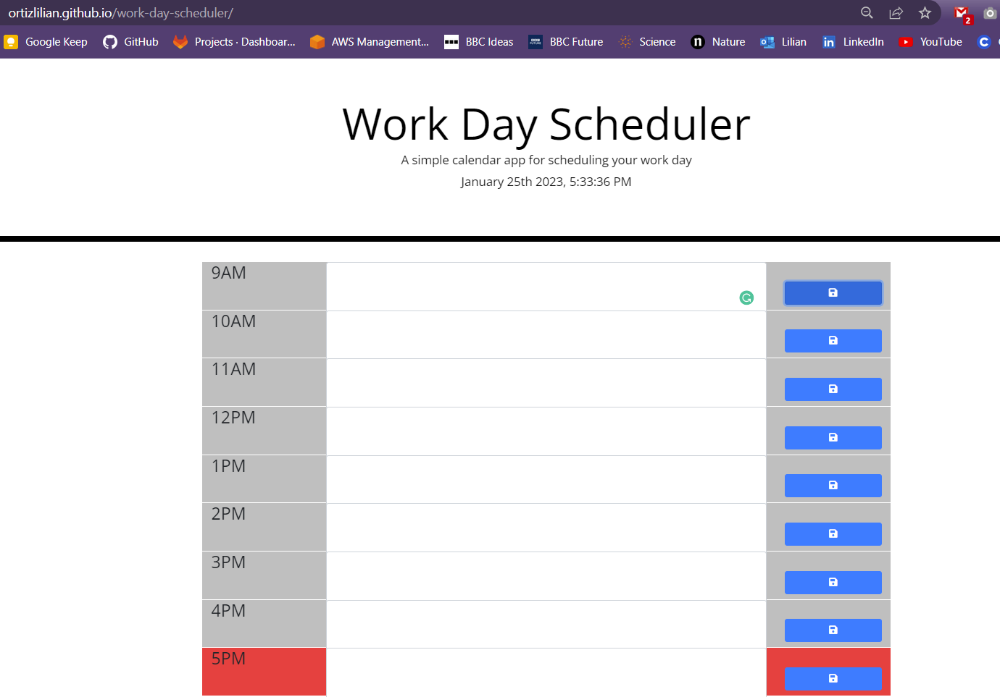

# Module `7` Challenge: Work Day Scheduler

## Description

This app functions as a calendar where you can enter your events for the day, and get them saved even if you refresh the page.

## Deployment

The app was deployed using Github Pages and can be accessed [here](https://ortizlilian.github.io/work-day-scheduler/).

## Screenshots

When the app is loaded on the browser it looks like this:

## Acceptance Criteria

- Display the current day at the top of the calender when a user opens the planner.
- Present timeblocks for standard business hours when the user scrolls down.
- Color-code each timeblock based on past, present, and future when the timeblock is viewed.
- Allow a user to enter an event when they click a timeblock
- Save the event in local storage when the save button is clicked in that timeblock.
- Persist events between refreshes of a page